# Aura Fashion Website

Aura is a full-stack fashion website which allows users to simulate purchasing clothes from popular streetwear brands. The website follows mobile-first principles and a minimalist design.
 

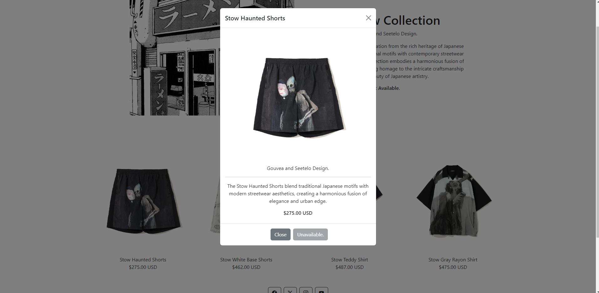
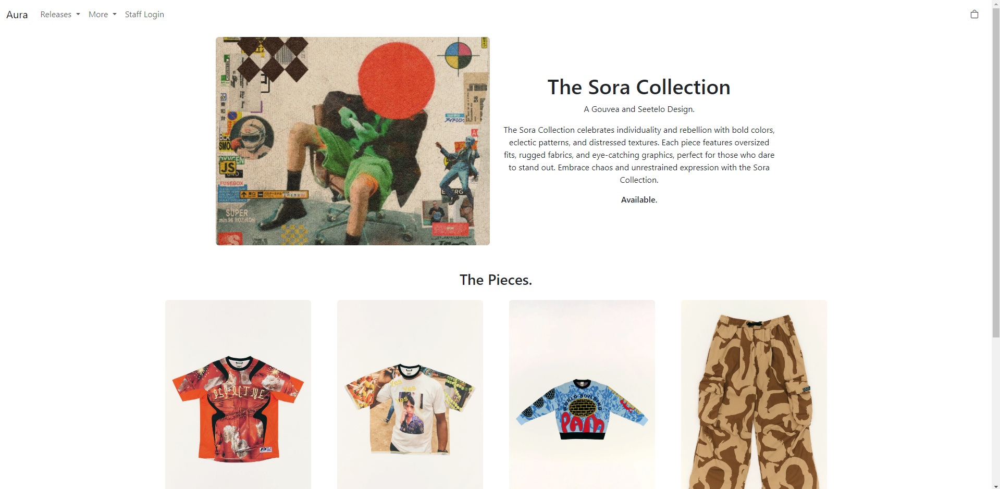

## Table of Contents
- [Interactive Features](#interactive-features)
  - [Integrated Shopping Cart](#integrated-shopping-cart)
  - [Responsive Design](#responsive-design)
  - [Dynamic Content Retrieval](#dynamic-content-retrieval)
  - [Order Management Page](#order-management-page)
  - [Order Processing](#order-processing)
- [Technologies Used](#technologies-used)
- [How to Install & Run](#how-to-install--run)

## Interactive Features

### Integrated Shopping Cart

Users are able to add items to their cart and maintain their selections across page refreshes (Vuex Persisted State).

    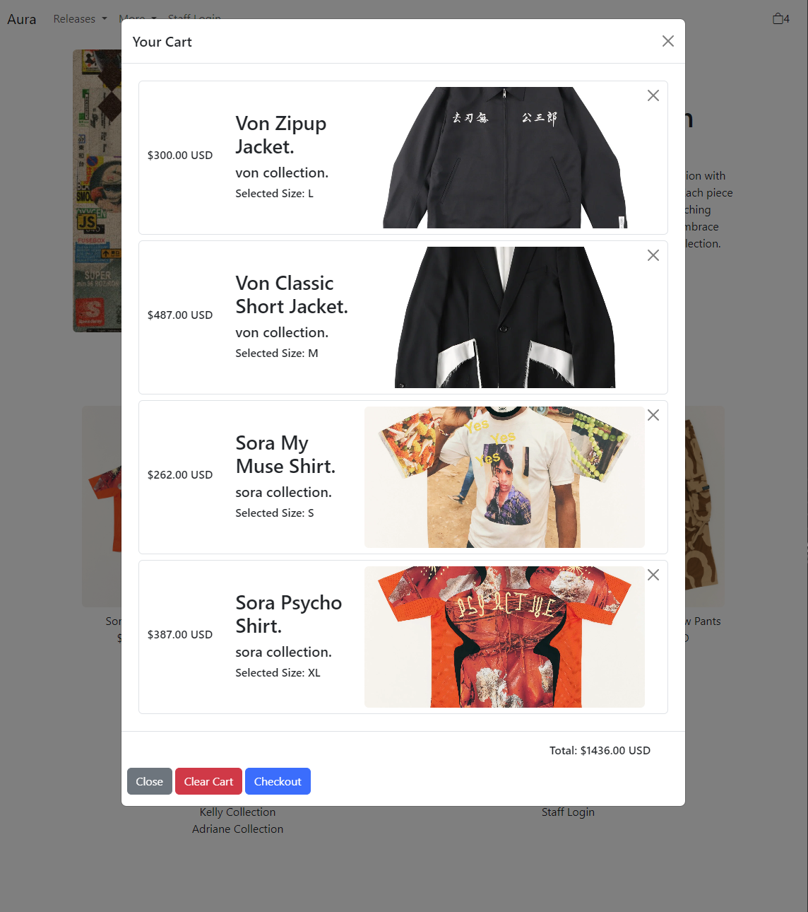
    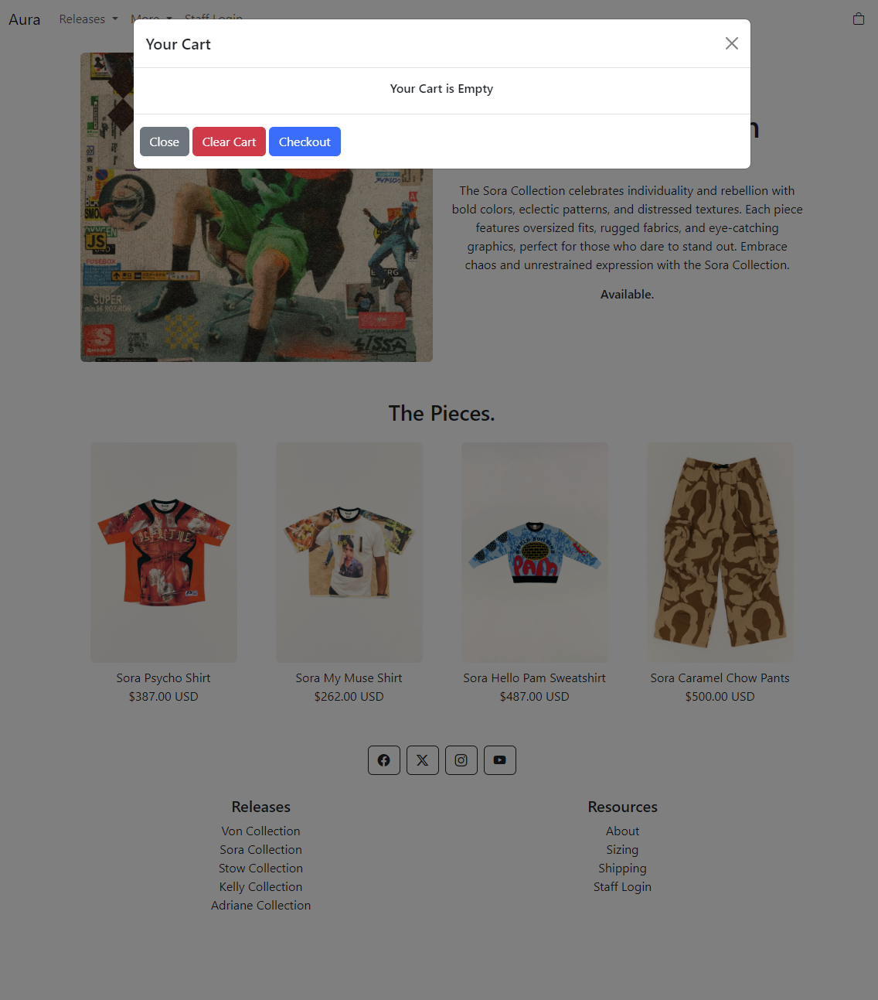

### Responsive Design

Ensures viewing and interaction on mobile devices, and across various screen sizes (Bootstrap).

    
    

### Dynamic Content Retrieval

Information is dynamic and fetched from a MySQL database, allowing for changes to product listings and availability (MySQL, Node.js).

    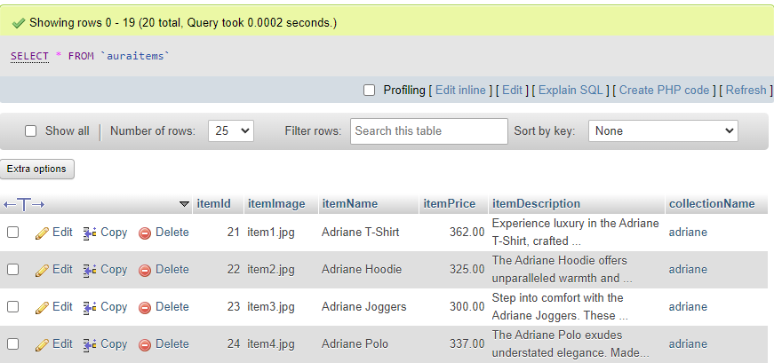
    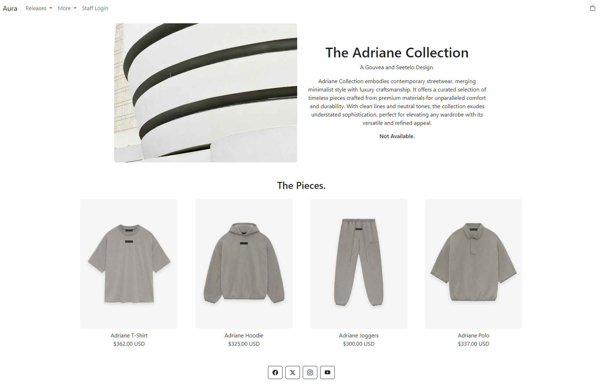

### Order Management Page

Staff can view and manage customer orders directly from the SQL database, allowing for order tracking.

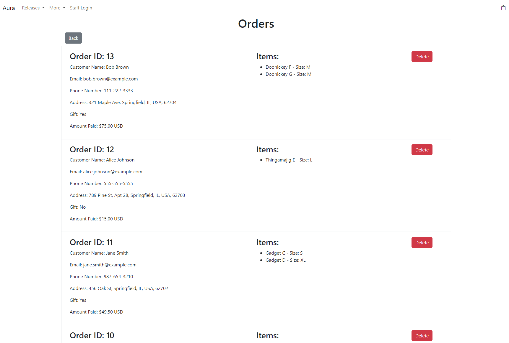  

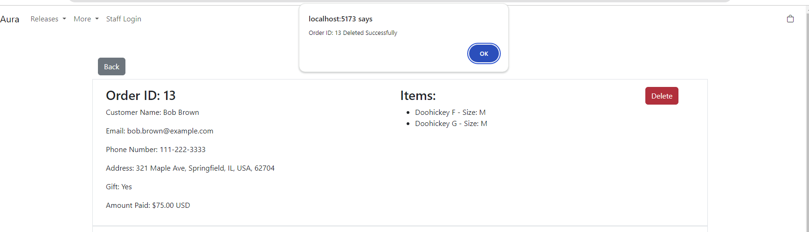  

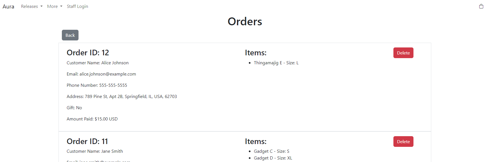

#### Order Processing

When users complete their purchases, the order details are uploaded to the MySQL database.

    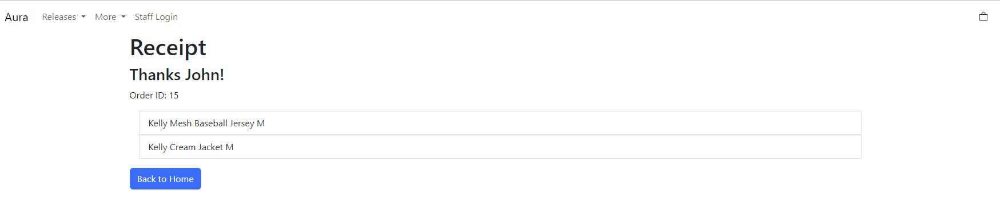
    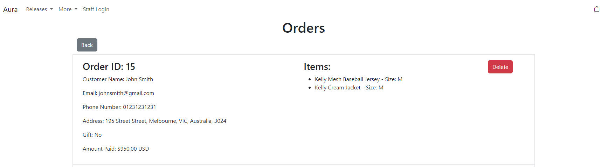

## Technologies Used

<ul>
    <li><strong>Frontend:</strong>
        <ul>
            <li>HTML5: For structuring the web pages.</li>
            <li>CSS3: For styling and layout design.</li>
            <li>JavaScript: Used in conjunction with Vue.js for dynamic content and interactivity.</li>
            <li>Vue.js: For building the user interface with a component-based architecture.</li>
        </ul>
    </li>
    <li><strong>Backend:</strong>
        <ul>
            <li>Node.js: For building server-side applications.</li>
            <li>Express.js: A web application framework for Node.js that simplifies routing and middleware handling.</li>
            <li>MySQL: For managing and storing relational data.</li>
        </ul>
    </li>
    <li><strong>Additional Tools:</strong>
        <ul>
            <li>Axios: For making HTTP requests from the frontend to the backend.</li>
        </ul>
    </li>
</ul>

## How to Install & Run

<ol>
    <li>
        
Clone this repository to your local machine using the following command:
 
        <pre><code>git clone https://github.com/sagaKnight/Aura-Webpages.git</code></pre>
    </li>
    <li>
        <strong>Set Up the MySQL Database</strong>
        <ol>
            <li>Start XAMPP: Open XAMPP Control Panel and start the Apache and MySQL services.</li>
            <li>
                <strong>Import the Database:</strong>
                
Open phpMyAdmin by going to <code>http://localhost/phpmyadmin</code>.

                
Create a new database (e.g., <code>auraproject.sql</code>).

                
Select the database and click on the "Import" tab.

                
Choose the exported <code>.sql</code> file from the <code>database</code> folder in your project.

                
Click "Go" to import the database.

            </li>
        </ol>
    </li>
    <li>
        <strong>Install Project Dependencies</strong>
        
Navigate to the Vue.js app directory (if it's within your main project folder) and install the necessary dependencies:

        <pre><code>cd Aura-Website</code></pre>
        <pre><code>npm install</code></pre>
    </li>
    <li>
        <strong>Start the Node Server</strong>
        
Open a new terminal, navigate to the <code>Aura-Website/src</code> directory, and start the Node server by running:

        <pre><code>cd Aura-Website/src</code></pre>
        <pre><code>node server.js</code></pre>
        
If successful, "connected to database" will be outputted to the terminal.

    </li>
    <li>
        <strong>Run the Development Server</strong>
        
Go back to your original terminal where you installed the project dependencies and start the development server by running:

        <pre><code>npm run dev</code></pre>
        
You should see output similar to this:

        <pre><code> VITE vX.X.X  ready in X seconds

 ➜  Local:   http://localhost:5173/
 ➜  Network: use --host to expose</code></pre>
    </li>
    <li>
        <strong>Open the App in Your Browser</strong>
        
Open your web browser and go to <code>http://localhost:5173/</code> to view the website.

    </li>
</ol>

